# Autonomous Paintball Turret - WIP

**AI-Powered Sentry Turret**

Video Link https://youtu.be/wq3cXFSN2co

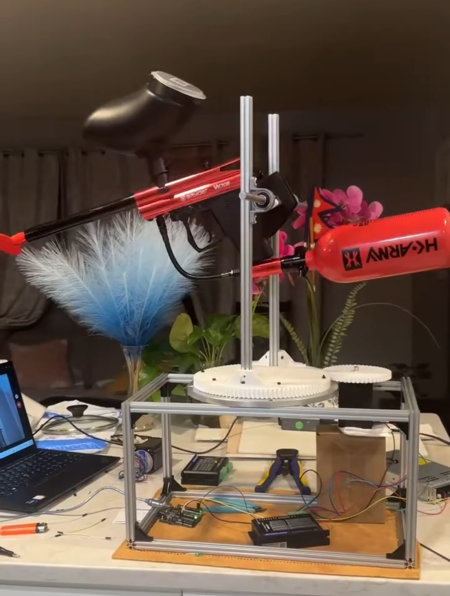

Still working on this project, took a break to attend the fallout hackathon in Shenzhen, China and have left home for Columbia University. Will resume building when I get back.

### Highlights

*   **AI Object Tracking** powered by a Raspberry Pi 5
*   **Rapid Dual-Axis Movement** using high-torque Nema 23 stepper motors
*   **~$500 Build Budget** 
*   **Aluminum Chassis**
*   **Custom 3D Printed Gears** made of PETG
*   **Laser-Guided Aiming** for calibration and precise targeting

### Why I made it!!!

After working on [https://github.com/coolerzanu/FPV-Drone-5-Analog], I wanted to dive deeper into a far more challenge application of robotics using computer vision and motion control. I decided to challenge myself by building a fully autonomous robotic sentry turret from scratch. This project served as the perfect intersection of mechanical engineering (the development of the chassis, and custom CAD components), electronics (power delivery and motor drivers), and software (AI object detection and driver control with embedded systems and mico-computers). Plus, testing it out with reusable rubber paintballs has been incredibly fun!

### Basic Overview - Parts

To build a robust and responsive turret capable of swinging a full-sized paintball marker, I sourced the following key components:

*   **IoT and control** **Raspberry Pi 5** for running the AI object tracking pipeline, communicating with an **Arduino Uno** microcontroller that handles the physical movement.
*   **Motion System:** Two **Nema 23 Stepper Motors** driven by **DM542T Stepper Motor Drivers**, providing the speed and torque needed for rapid targeting.
*   **Mechanics & Frame:**
*   *   **Aluminum Extrusions** for the primary frame
    *   Custom 3D printed mounts using **Bambu Labs PETG** for strength.
    *   Custom 3D printed **herringbone gears** made of PETG. 
    *   A heavy-duty **Lazy Susan Bearing** for smooth X-axis (pan) rotation.
    *   Two **Wide Ball Bearings** for the Y-axis (tilt).
    *   **Brass Threaded Inserts** to securely bolt the plastic parts together.
    *   **M3 Screws**
    *   **Belt driven pullly*** for y-axsis
*   **Power:**
    *   **Meanwell LRS-350-24 Power Supply**
*   **The Device:**
    *   An **Action Village Kingman Paintball Gun**, fired mechanically by a **20N Solenoid** pulling the trigger, aimed via a **Red Laser pointer** module.

---

### CAD

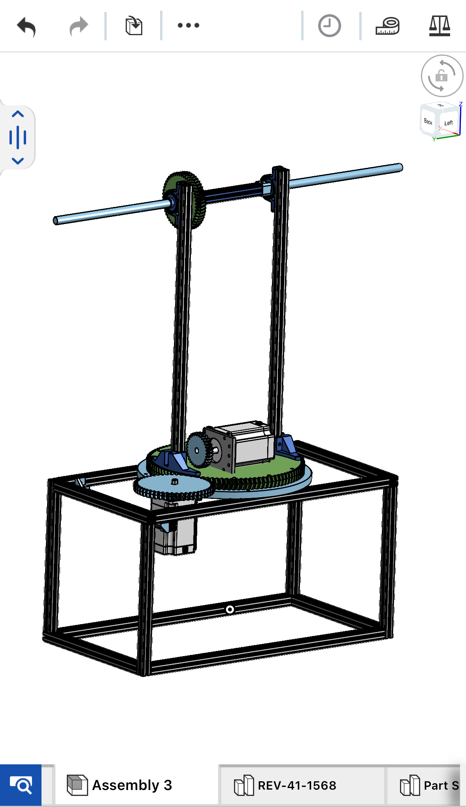

Gears

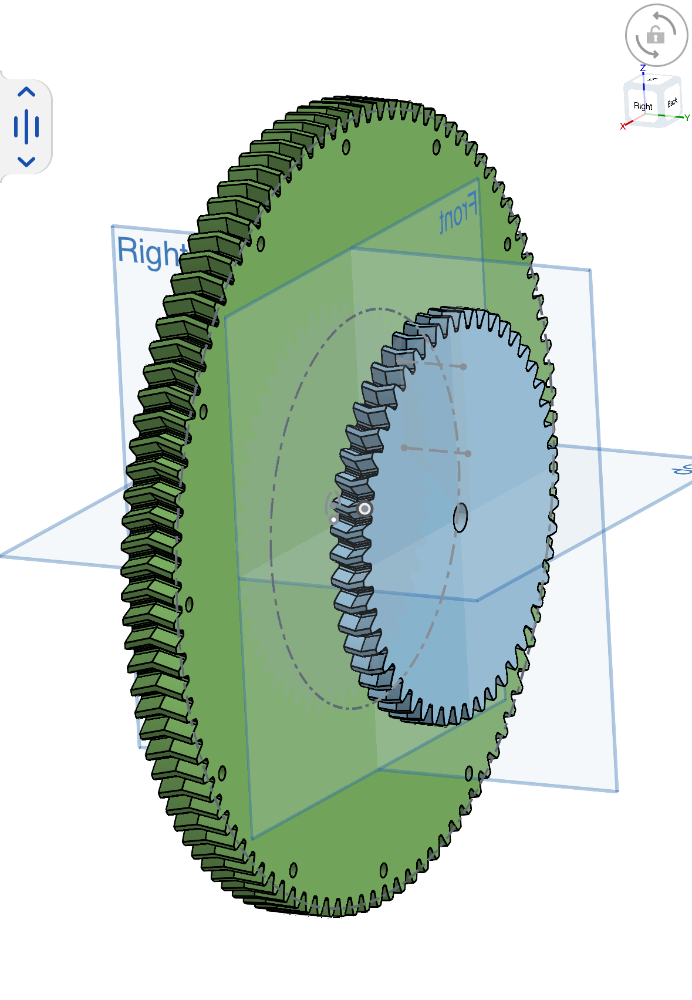

---

### Basic Progression

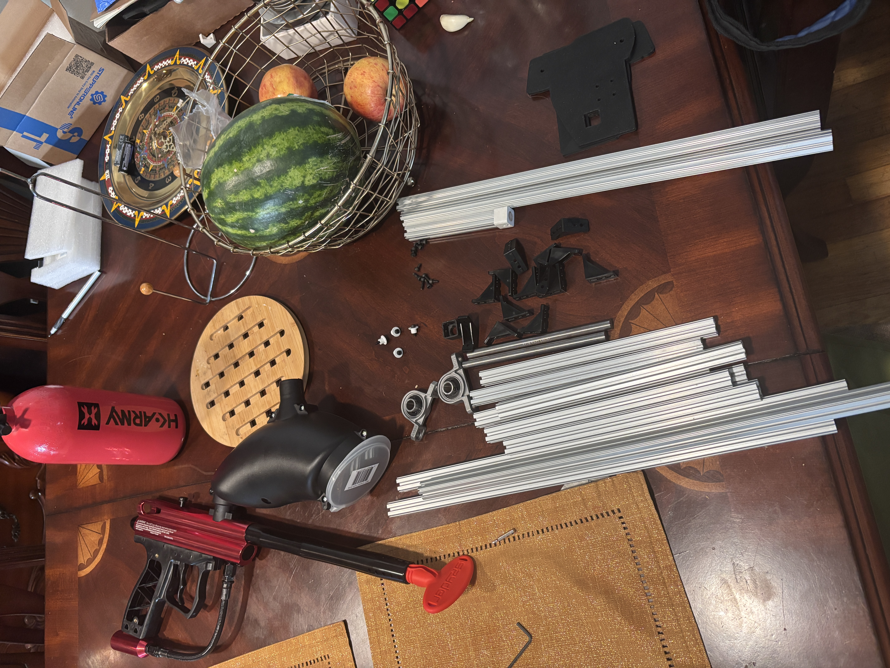

**Printing**

Printed all needed materials

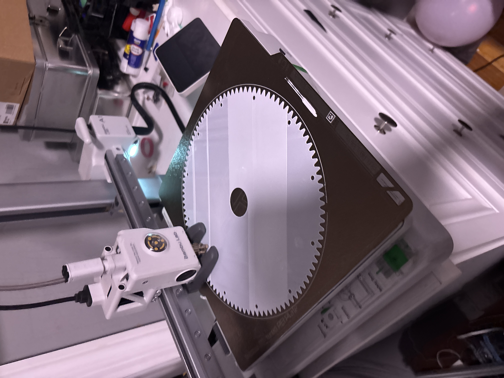

 **Mechanical Assembly:** Assembled all structural components for the frame with Aluminum extrusions and printed brackets.

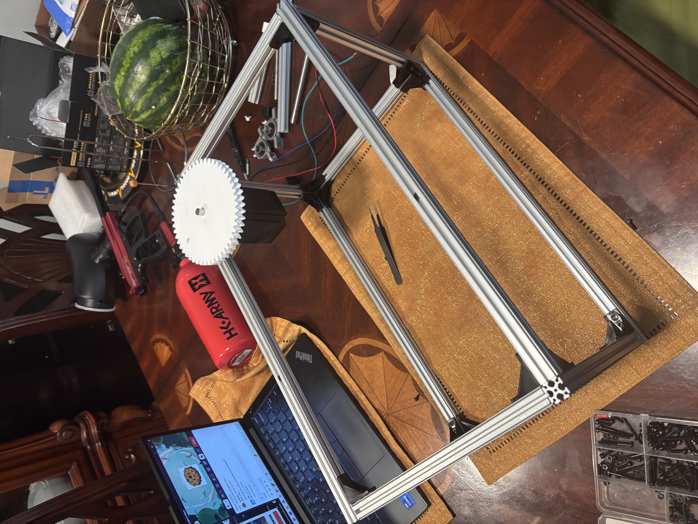

Attached Large X-axsis Herrigbore gear to Lazy Susan before mounting it on the chassis. 
(Used heat-pressed brass inserts to connect any plastic to metal.)

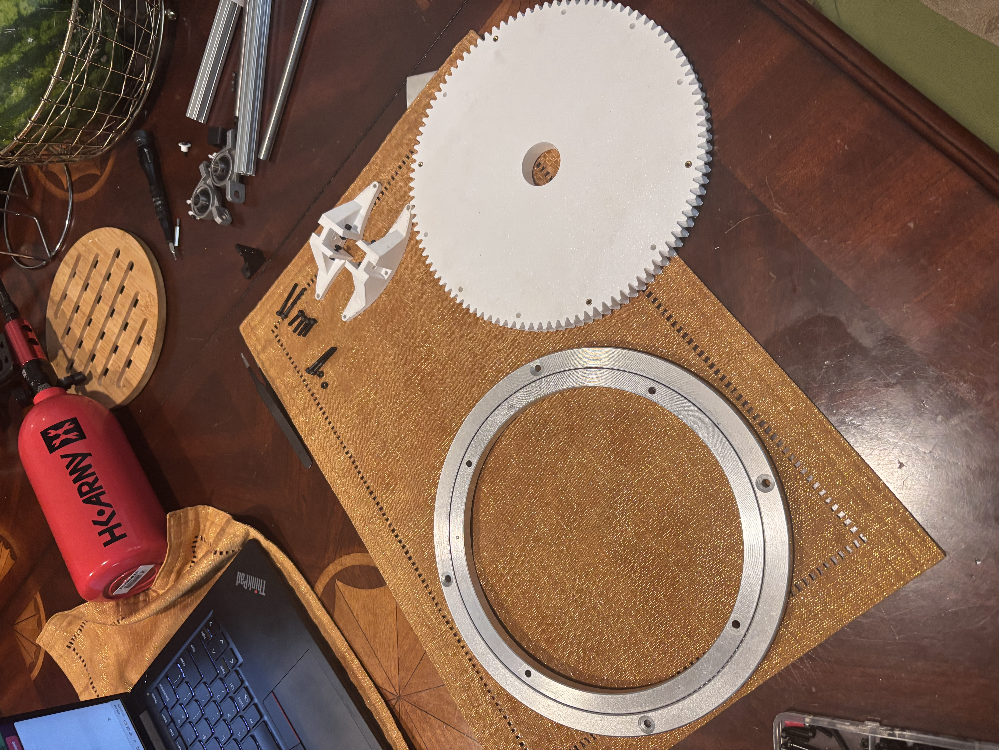

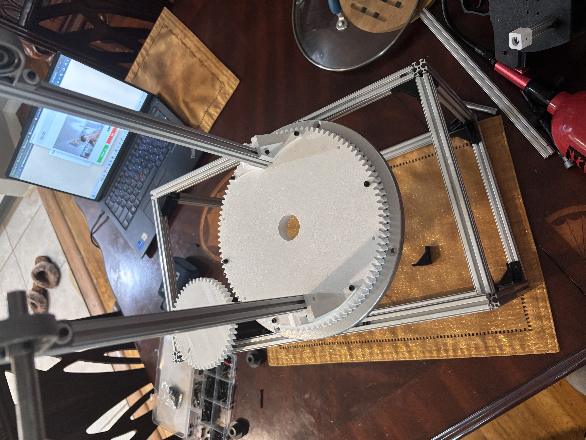

Secured Y-axsis gantry onto the chassis and prepared to mount device.

5.  **Mounting the Hardware:**

Secured the paintball device to the Y-axis gantry with custom 3d printed parts. Attached the Nema 23 stepper motors to their respective axes.

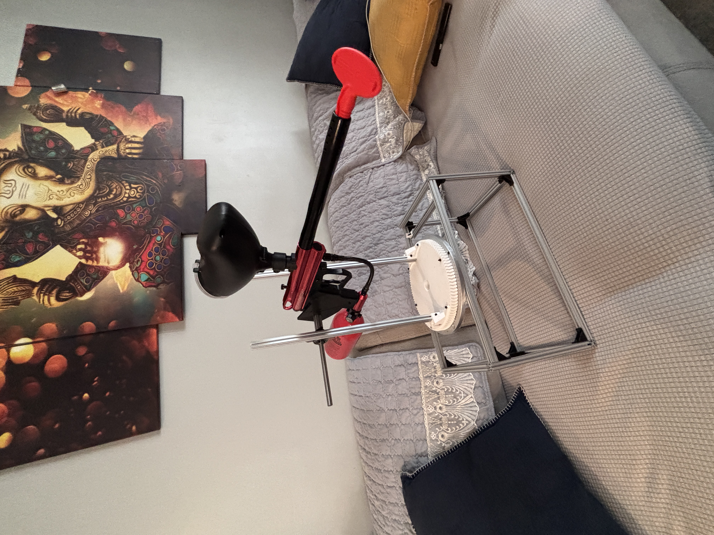

7.  **Electronics & Wiring:**

Wired the Meanwell 24V power supply to AC wall outlet and the DM542T stepper drivers.

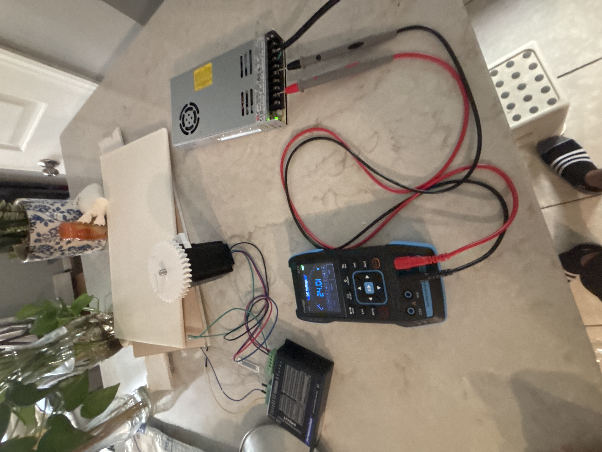

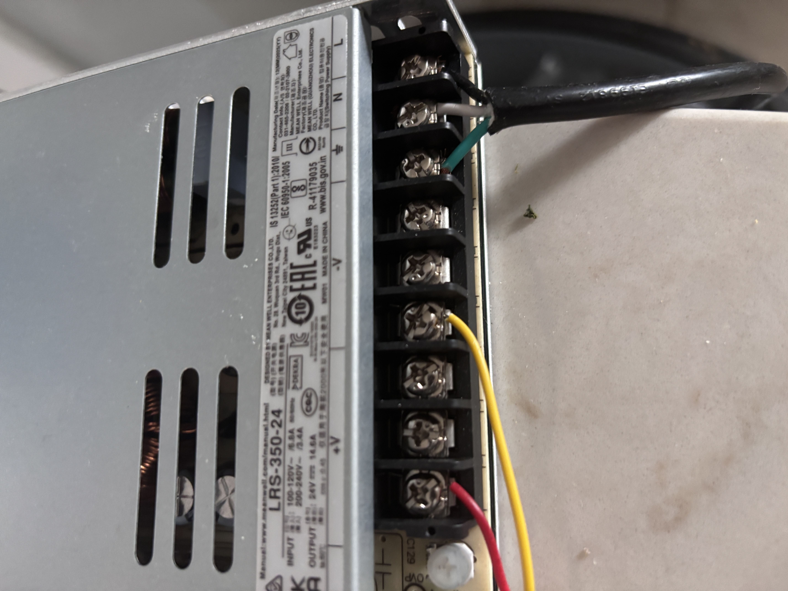

Wired Motor Driver to Nema23 motors

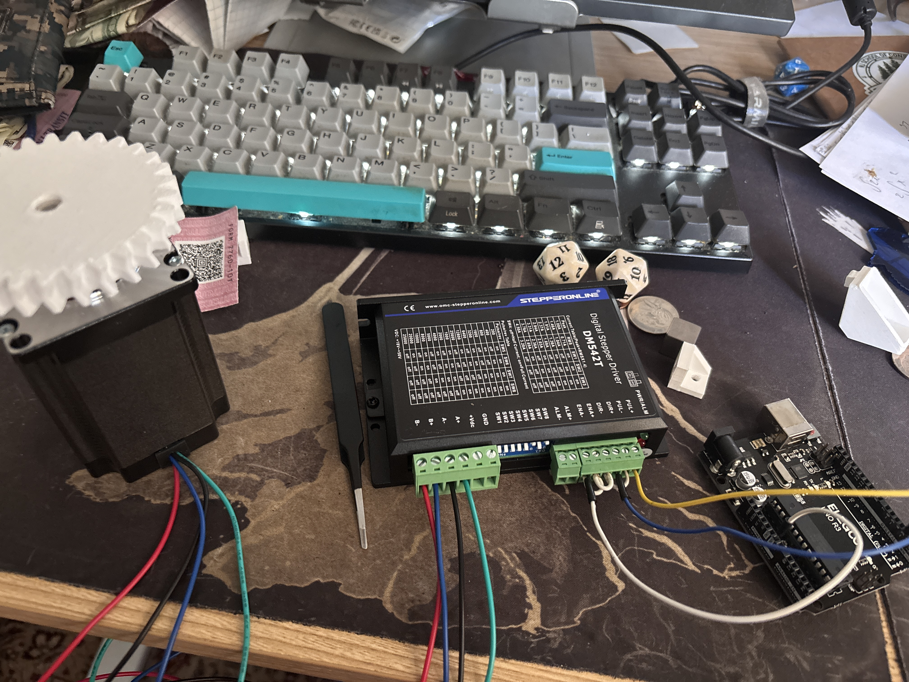

Arduino Uno was powered with external battery and wired to motor drivers. 
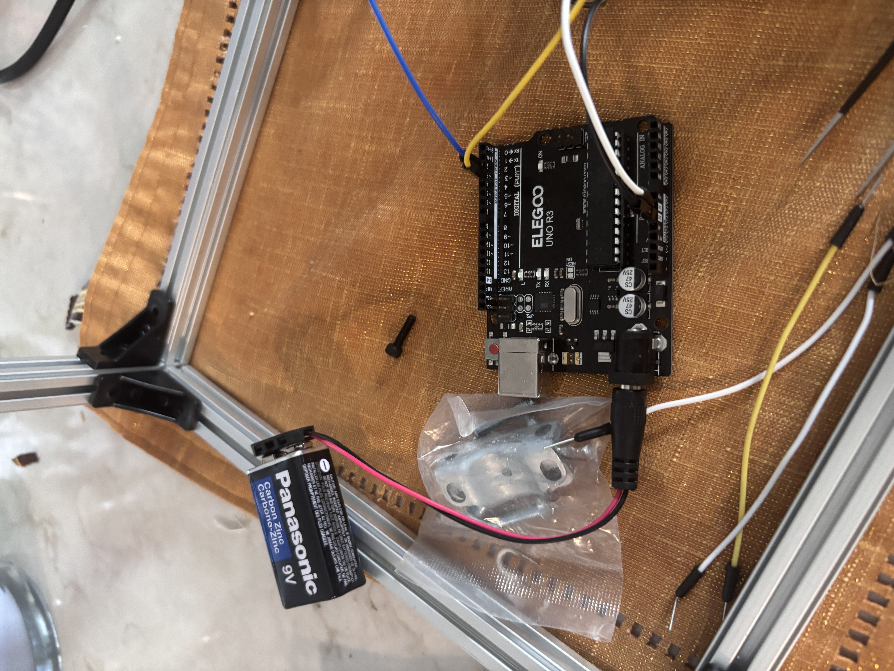

7.  **Integration:** TBD

---

### Basic Overview - Software & Firmware

The turret's intelligence relies on a dual-controller setup to handle both high-level processing and low-level hardware communication. The setup process included:

*   **Computer Vision (Raspberry Pi 5):** Running an object detection model OpenCV to identify targets in the camera frame, calculate their center point, and determine the offset from the crosshairs.
*   **Motion Translation (Arduino Uno):** Receiving coordinate offsets from the Pi via serial communication and translating them into precise step-and-direction pulses for the DM542T motor drivers.
*   **Firing Logic:** Programming the Arduino Uno to trigger the 20N solenoid only when the target is centered in the "kill box" and the motors have momentarily stopped moving.

### Credits

Written with StackEdit.
